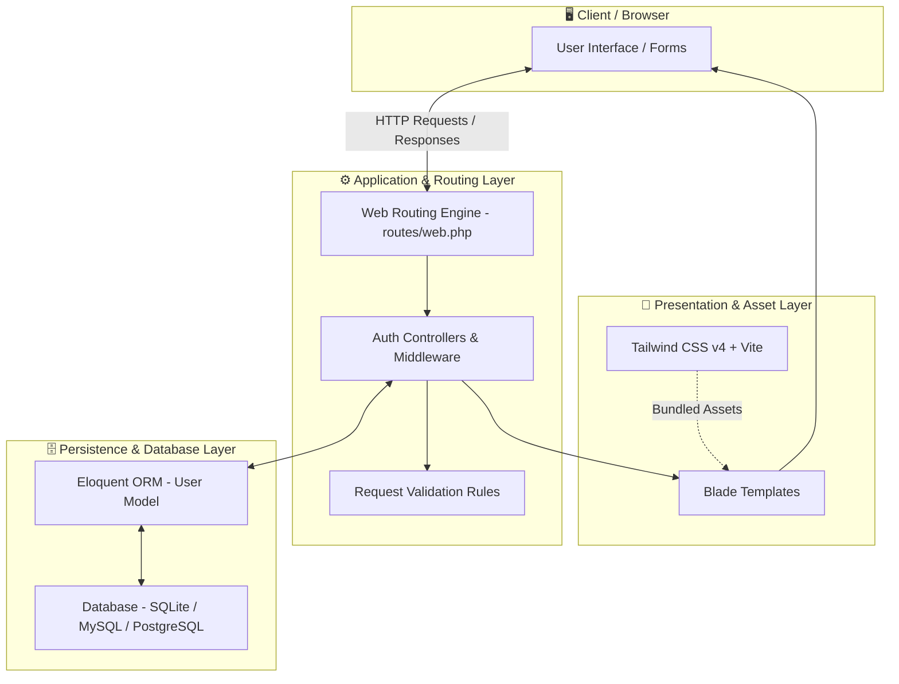

# FormRDD - Authentication & User Access Portal

A modern, robust web application built with **Laravel** and **Tailwind CSS** designed to demonstrate and provide a secure, seamless **Login and Sign-up (Registration)** user authentication flow.

---

## 🎯 Purpose of the Project

The primary purpose of **FormRDD** is to demonstrate a modern, responsive, and secure authentication system featuring:
- **User Registration (Sign-up):** Capture user credentials, apply validation rules, sanitize input, and securely hash passwords before storing records.
- **User Authentication (Login):** Provide authenticated session management, remember-me functionality, and protection against brute-force / credential attacks.
- **Form UI/UX Standards:** Showcase clean, accessible, and responsive form interfaces built with Tailwind CSS and Vite.
- **Enterprise-Ready Foundation:** Provide an extensible starting point following standard Laravel conventions and architectural best practices.

---

## 🏗️ Architecture & System Design

FormRDD is built on the **Model-View-Controller (MVC)** architectural pattern provided by the Laravel framework:



### Architectural Breakdown

1. **Presentation Layer (View):**
   - **Blade Templates (`resources/views/`):** Lightweight, server-rendered views with modular components.
   - **Tailwind CSS (`@tailwindcss/vite`):** Modern utility-first styling for accessible and responsive form interfaces.
2. **Application Layer (Controller & Middleware):**
   - **Routing (`routes/web.php`):** Clean endpoint mappings for authentication routes.
   - **Controllers (`app/Http/Controllers/`):** Orchestrates authentication logic, session handling, and response redirection.
   - **Form Requests & Validation:** Input validation protecting against invalid email formats, weak passwords, and duplicate user records.
3. **Data & Persistence Layer (Model):**
   - **Eloquent ORM (`app/Models/User.php`):** Object-Relational Mapping providing an intuitive interface for user record operations.
   - **Database Migrations (`database/migrations/`):** Version-controlled schema definitions for users, sessions, cache, and password reset tokens.

---

## 🛠️ Technology Stack

| Layer | Technology | Version / Details |
| :--- | :--- | :--- |
| **Backend Framework** | [Laravel](https://laravel.com/) | `v12 / v13` (PHP framework) |
| **Runtime Environment** | [PHP](https://www.php.net/) | `^8.3` (with modern type safety) |
| **Frontend Styling** | [Tailwind CSS](https://tailwindcss.com/) | `^4.0` |
| **Asset Bundler** | [Vite](https://vitejs.dev/) | `^8.0` |
| **Database** | SQLite / MySQL / PostgreSQL | Default: SQLite with Eloquent ORM |
| **Testing Suite** | [Pest PHP](https://pestphp.com/) | `^5.1` |
| **Code Style Formatter**| [Laravel Pint](https://laravel.com/docs/pint) | `^1.27` |
| **Process Manager** | [Concurrently](https://github.com/open-cli-tools/concurrently) | `^10.0` (Unified dev server) |

---

## ✨ Features

- [x] **Sign-Up (User Registration):**
  - Name, Email, Password, and Password Confirmation fields.
  - Client & Server-side validation rules.
  - Automatic password hashing via `bcrypt`/`argon2id`.
- [x] **Sign-In (User Login):**
  - Secure credential verification.
  - Session regeneration on login to prevent session fixation.
  - Rate limiting / throttling against brute-force login attempts.
- [x] **Sign-Out (Logout):**
  - Session invalidation and CSRF token regeneration.
- [x] **Responsive Layouts:**
  - Optimized for mobile, tablet, and desktop viewports.
- [x] **Developer Ergonomics:**
  - Unified `composer run dev` command running Vite and PHP development servers concurrently.

---

## 🚀 Getting Started

### Prerequisites

Ensure you have the following installed on your machine:
- **PHP** >= 8.3 (with `bcmath`, `curl`, `mbstring`, `openssl`, `pdo_sqlite` or `pdo_mysql` extensions)
- **Composer** (PHP dependency manager)
- **Node.js** (>= 18.x) & **npm**

### Installation

1. **Clone the repository:**
   ```bash
   git clone <repository-url>
   cd formrdd
   ```

2. **Automated Setup (Single Command):**
   ```bash
   composer run setup
   ```
   *This command installs PHP/Node dependencies, sets up the `.env` file, generates the application key, runs migrations, and builds frontend assets.*

   --- *Or follow the manual step-by-step setup below:* ---

3. **Install Dependencies:**
   ```bash
   composer install
   npm install
   ```

4. **Environment Setup:**
   ```bash
   copy .env.example .env     # On Windows (cmd)
   # or: cp .env.example .env  # On PowerShell / macOS / Linux
   ```

5. **Generate Application Key:**
   ```bash
   php artisan key:generate
   ```

6. **Run Database Migrations:**
   ```bash
   php artisan migrate
   ```

---

## 💻 Running the Application

### Option 1: Unified Development Server (Recommended)
Start the Laravel backend, queue worker, and Vite asset compiler simultaneously:
```bash
composer run dev
```

### Option 2: Individual Processes
Run backend and frontend independently:
```bash
# Terminal 1 - Backend Server
php artisan serve

# Terminal 2 - Vite Dev Server
npm run dev
```

Once running, access the application in your browser at:
👉 **`http://127.0.0.1:8000`**

---

## 🧪 Testing & Code Quality

- **Run Pest Test Suite:**
  ```bash
  composer test
  # or
  php artisan test
  ```

- **Format Code with Laravel Pint:**
  ```bash
  vendor/bin/pint
  ```

---

## 📁 Directory Structure

```text
formrdd/
├── app/
│   ├── Http/
│   │   └── Controllers/       # Application controllers handling auth requests
│   └── Models/                # Eloquent models (User, etc.)
├── config/                    # Application configuration files
├── database/
│   ├── factories/             # Model factories for testing
│   ├── migrations/            # Database schema migrations
│   └── seeders/               # Database seeders
├── public/                    # Web root directory (index.php, static assets)
├── resources/
│   ├── css/                   # Tailwind CSS styling source files
│   ├── js/                    # Frontend JavaScript files
│   └── views/                 # Blade view templates
├── routes/
│   ├── console.php            # Artisan console routes
│   └── web.php                # Web routes & authentication endpoints
├── tests/                     # Pest feature and unit tests
├── vite.config.js             # Vite bundler configuration
└── composer.json              # PHP dependencies and automation scripts
```

---

## 🔒 Security Best Practices

- **CSRF Protection:** All registration and login forms include `@csrf` token validation to prevent Cross-Site Request Forgery.
- **Password Security:** Passwords are never stored in plaintext and are hashed using strong cryptographic algorithms.
- **SQL Injection Prevention:** Eloquent ORM utilizes PDO parameter binding by default.
- **XSS Mitigation:** Blade templates automatically escape raw HTML output using `{{ ... }}` syntax.

---

## 📄 License

This project is open-sourced software licensed under the [MIT license](https://opensource.org/licenses/MIT).
